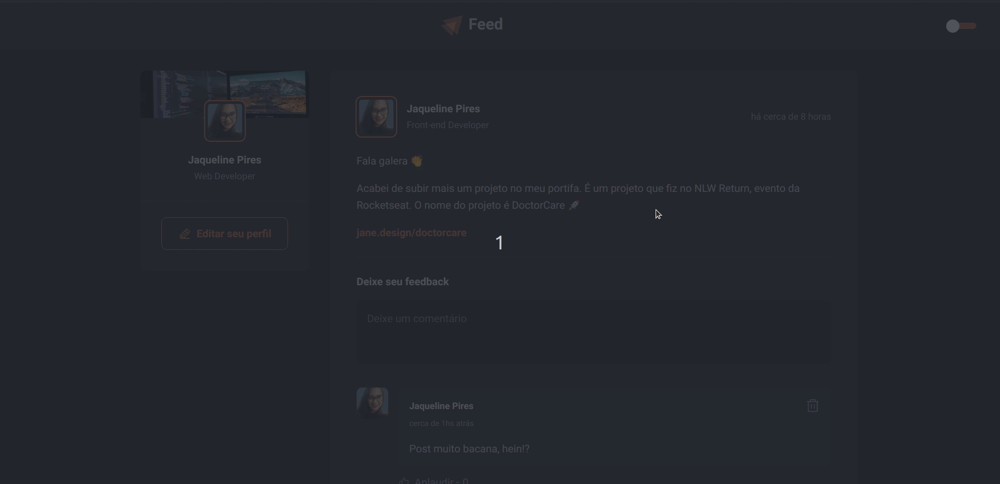

<h1 align=center># Feed</h1>



---

## 👨🏻‍💻 Sobre o Projeto

Um Uma aplicação React utilizando o Vite e colocando em pratica conceitos de componentização, propriedades, estados, imutabilidade e hooks.

---

## 👨🏻‍💻 Tecnologias

- React
- Typescript
- Hooks
- Styled-component

---

## 💻 Instalação e uso

```
$ git clone https://github.com/jaquelinepires/Feed-web.git
```

3. Vá para a pasta Feed-web:

```
$ cd Feed-web
```

4. Instale as dependêcias:

```
$ npm i
$ yarn
```

5. Agora, execute o aplicativo:

```
$ npm start
$ yarn start
```

Caso não abra automaticamente, acesse http://localhost:3000 para visualizá-lo no navegador.

---

Feito com 💙 by Jaqueline Pires